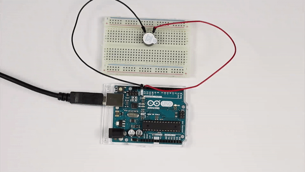
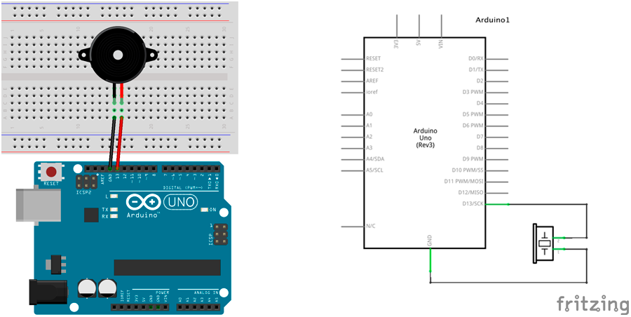
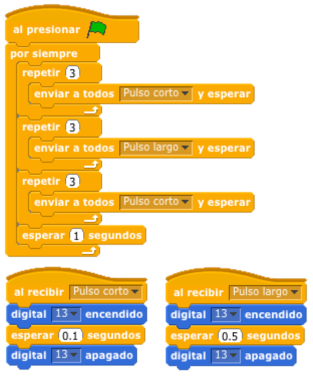

# Código Morse SOS



<audio controls="controls">
  <source type="audio/ogg" src="https://upload.wikimedia.org/wikipedia/commons/f/f6/SOS_morse_code.ogg"></source>
  <p>Your browser does not support the audio element.</p>
</audio>

En esta práctica te proponemos que programes el código fuente para reproducir el sonido de SOS del Código Morse utilizando un zumbador.

1.	[Materiales](#materiales)
2.	[Diagrama de flujo](#diagrama-de-flujo)
3.	[Esquema eléctrico](#esquema-eléctrico)
4.	[Programación en S4A](#programación-en-s4a)
5.	[Programación en Arduino](#programación-en-arduino)
6.  [Video resumen](#video-resumen)


***


### Materiales

Para llevar a cabo la práctica, vamos a necesitar los siguientes materiales:
- 1 Placa de Arduino UNO
- 1 Protoboard
- 2 latiguillos
- 1 Zumbador


<br />
=============
<br />


### Diagrama de flujo

Antes de ponernos a desarrollar la práctica, conviene realizar un diagrama de flujo para entender la lógica de la programación.


[Descarga el diagrama de flujo para imprimir](Diagrama de flujo.html)


<br />
=============
<br />


### Esquema eléctrico

Como se puede observar en la siguiente tabla, nuestros cumbadores tienen una tensión de trabajo de 3-12V. Con lo cual no vamos a necesitar conectarle ninguna resistencia puesto que la salida de nuestros pines de Arduino son de 5V.

| Zumbador piezo-eléctrico         |       |
| -------------------------------- | ----- |
| Polarizado                       | Sí    |
| Tensión de trabajo               | 3-12V |




[Descarga el esquema eléctrico para Fritzing](Esquema eléctrico.fzz)


<br />
=============
<br />


### Programación en S4A

Fijándonos en el diagrama de flujo programamos la práctica mediante lenguaje de programación por bloques S4A. 

Podrás observar el gran parecido que se tiene con el diagrama de flujo.



[Descarga el código para S4A](S4A.sb)


<br />
=============
<br />


### Programación en Arduino

Al igual que en el apartado anterior y fijándonos en el diagrama de flujo, programamos en Arduino la práctica propuesta.

```
/**
 * Código Morse SOS
 *
 * En esta práctica te proponemos que programes el código fuente para
 * reproducir el sonido de SOS del Código Morse utilizando un zumbador.
 *
 * @author Miguel Ángel Abellán
 * @company El Cable Amarillo
 * @license Creative Commons. Reconocimiento CompartirIgual 4.0 (Se
 * permite el uso comercial de la obra y de las posibles obras derivadas,
 * la distribución de las cuales se debe hacer con una licencia igual a
 * la que regula la obra original.)
 */

// Definimos las variables de tipo entero
int zumPin = 13;
int delayTime = 3000;

//Este código se ejecuta la primera vez
void setup() {
  // Configuramos el pin en modo salida
  pinMode(zumPin, OUTPUT);
}

//Este código se ejecuta en bucle repetidamente
void loop() {
  // Llamamos a la función pulsoCorto pasándole por parámetro el tiempo
  for(int i=0; i<3; i++){
    pulso(100);
  }
  // Llamamos a la función pulsoCorto pasándole por parámetro el tiempo
  for(int i=0; i<3; i++){
    pulso(500);
  }
  // Llamamos a la función pulsoCorto pasándole por parámetro el tiempo
  for(int i=0; i<3; i++){
    pulso(100);
  }
  // Tiempo de espera para nuevo mensaje SOS
  delay(delayTime);
}

// Función pulso donde le pasamos parámetro el tiempo de espera
void pulso(int tiempo) {
    digitalWrite(zumPin, HIGH);
    delay(tiempo);
    digitalWrite(zumPin, LOW);
    delay(tiempo);
}
```

[Descarga el código para Arduino](Arduino/Arduino.ino)


<br />
=============
<br />


### Video resumen

[](https://youtu.be/_g6Fm5Ic6O4)


***


#### Licencia

 Esta obra se distribuye bajo licencia [Reconocimiento-CompartirIgual 4.0 Internacional (CC BY-SA 4.0)](https://creativecommons.org/licenses/by-sa/4.0/deed.es_ES).
