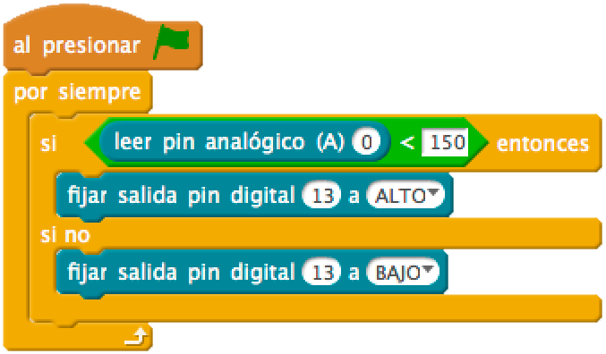

# Encendido nocturno


En esta práctica tenemos que programar utilizando un sensor LDR el encendido nocturno de un led.

1.	[Materiales](#materiales)
2.	[Diagrama de flujo](#diagrama-de-flujo)
3.	[Esquema eléctrico](#esquema-eléctrico)
4.	[Programación en mBlock](#programación-en-mblock)
5.	[Programación en S4A](#programación-en-s4a)
6.	[Programación en Arduino](#programación-en-arduino)
7.  [Video resumen](#video-resumen)


***


### Materiales

Para llevar a cabo la práctica, vamos a necesitar los siguientes materiales:
- 1 Placa de Arduino UNO
- 1 Protoboard
- 4 latiguillos
- 2 resistencias
- 1 sensor LDR
- 1 diodo led


<br />
=============
<br />


### Diagrama de flujo

Antes de ponernos a desarrollar la práctica, conviene realizar un diagrama de flujo para entender la lógica de la programación.


[Descarga el diagrama de flujo para imprimir](Diagrama de flujo.html)


<br />
=============
<br />


### Esquema eléctrico

Para realizar el montaje correctamente en nuestra placa de prototipado, necesitaremos conectar una resistencia al circuito (Pull-Down o Pull-Up). Estas dos resistencias son un mecanismo básico y habitual dentro del mundo de la electrónica.
- La resistencia de Pull-Up fuerza HIGH cuando el pulsador está abierto. Cuando está cerrado el PIN se pone a LOW, la intensidad que circula se ve limitada por esta resistencia.
- La resistencia de Pull-Down fuerza LOW cuando el pulsador está abierto. Cuando está cerrado el PIN se pone a HIGH, y la intensidad que circula se ve limitada por esta resistencia.

| Sensor LDR                        |       |
| --------------------------------- | ----- |
| Polarizado                        | No    |
| Resistencia mínima (con luz)      | 100Ω  |
| Resistencia máxima (sin luz)      | 1MΩ   |

El valor de la resistencia viene condicionado por la intensidad que pasa por el sensor LDR. En este caso podemos tomar una resistencia de 10KΩ.

Por otro lado, hay añadir un led al circuito con su respectiva resistencia como hemos calculado en prácticas anteriores.

```

V = 1,7V
I = 20mA

V = I x R ; R = V / I

R = 1,7V / 0,02A = 85Ω 

```

Redondeamos el resultado obtenido a un valor de resistencia conocido (siempre por encima de su resistencia ideal), obtenemos un valor de 100Ω (marrón-negro-marrón).

El siguiente paso será conectar los diferentes componentes sobre la placa de prototipado siguiendo el esquema eléctrico.


[Descarga el esquema eléctrico para Fritzing](Esquema eléctrico.fzz)


<br />
=============
<br />


### Programación en mBlock

Fijándonos en el diagrama de flujo programamos la práctica mediante lenguaje de programación por bloques mBlock. 

Podrás observar el gran parecido que se tiene con el diagrama de flujo.



[Descarga el código para mBlock](mBlock.sb2)


<br />
=============
<br />


### Programación en S4A

Fijándonos en el diagrama de flujo programamos la práctica mediante lenguaje de programación por bloques S4A. 

Podrás observar el gran parecido que se tiene con el diagrama de flujo.


[Descarga el código para S4A](S4A.sb)


<br />
=============
<br />


### Programación en Arduino

Al igual que en el apartado anterior y fijándonos en el diagrama de flujo, programamos en Arduino la práctica propuesta.

```
/**
 * Encendido nocturno
 *
 * En esta práctica tenemos que programar utilizando un sensor LDR
 * el encendido nocturno de un led.
 *
 * @author Miguel Ángel Abellán
 * @company El Cable Amarillo
 * @license Creative Commons. Reconocimiento CompartirIgual 4.0 (Se
 * permite el uso comercial de la obra y de las posibles obras derivadas,
 * la distribución de las cuales se debe hacer con una licencia igual a
 * la que regula la obra original.)
 */

// Se definen las variables de tipo entero
int ledPin = 13;
int ldrPin = 0;
int limite = 150;

//Este código se ejecuta la primera vez
void setup() {
  // Configuramos el pin en modo salida
  pinMode(ledPin, OUTPUT);
  pinMode(ldrPin, INPUT);
}

//Este código se ejecuta en bucle repetidamente
void loop() {

  // Lectura del pin del interruptor
  if (analogRead(ldrPin) > limite) {
    digitalWrite(ledPin, HIGH);
  }
  else {
    digitalWrite(ledPin, LOW);
  }
}
```

[Descarga el código para Arduino](Arduino/Arduino.ino)


<br />
=============
<br />


### Video resumen

[](https://youtu.be/w-s0vDaTblg)


***


#### Licencia

 Esta obra se distribuye bajo licencia [Reconocimiento-CompartirIgual 4.0 Internacional (CC BY-SA 4.0)](https://creativecommons.org/licenses/by-sa/4.0/deed.es_ES).
