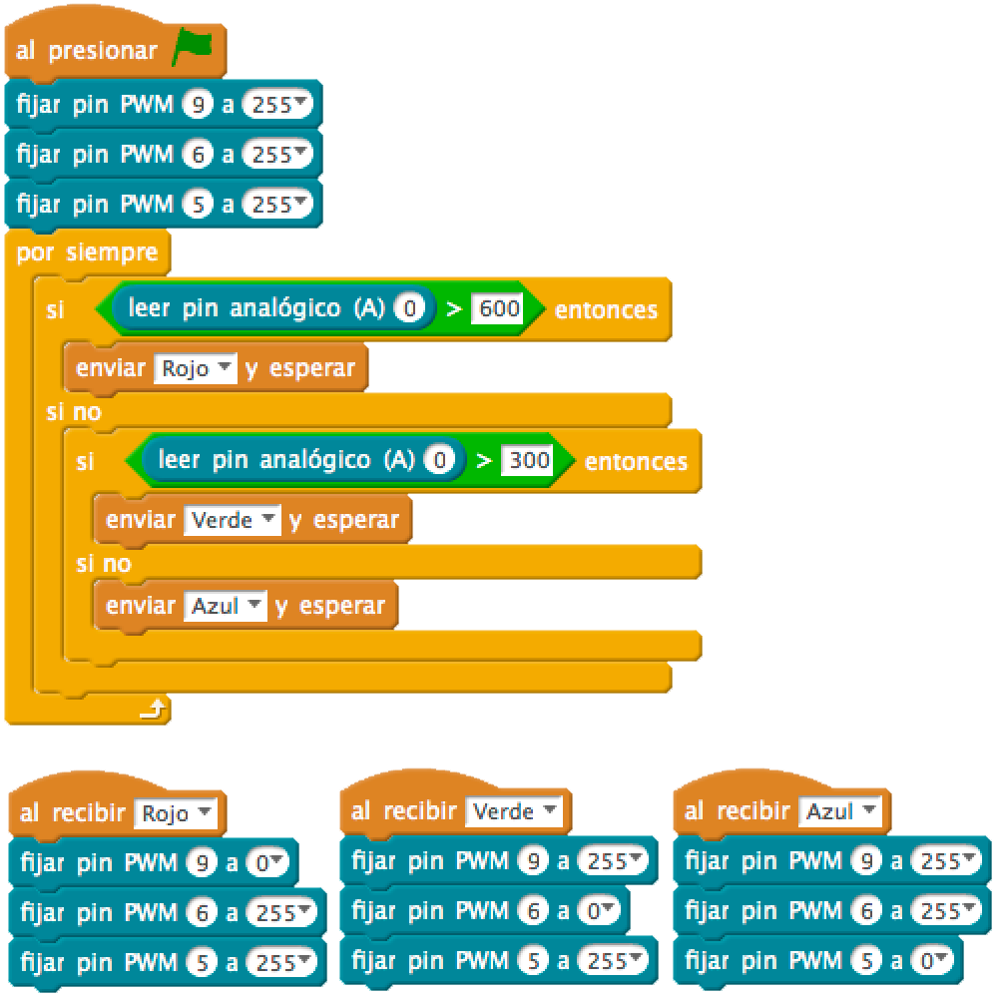
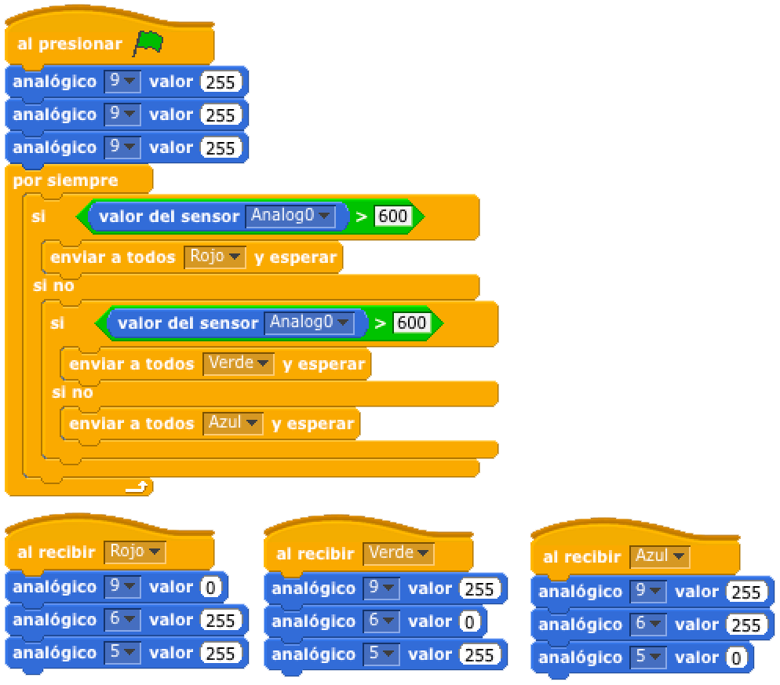

# Led RGB crepuscular


En esta práctica vamos a visualizar los colores rojos, verde y azul a medida que disminuye o aumenta la cantidad de luz en el sensor LDR.

1.	[Materiales](#materiales)
2.	[Diagrama de flujo](#diagrama-de-flujo)
3.	[Esquema eléctrico](#esquema-eléctrico)
4.	[Programación en mBlock](#programación-en-mblock)
5.	[Programación en S4A](#programación-en-s4a)
6.	[Programación en Arduino](#programación-en-arduino)
7.  [Video resumen](#video-resumen)


***


### Materiales

Para llevar a cabo la práctica, vamos a necesitar los siguientes materiales:
- 1 Placa de Arduino UNO
- 1 Protoboard
- 7 latiguillos
- 1 Diodo Led RGB (ánodo común)
- 3 Resistencia
- 1 sensor LDR


<br />
<hr>
<br />


### Diagrama de flujo

Antes de ponernos a desarrollar la práctica, conviene realizar un diagrama de flujo para entender la lógica de la programación.


[Descarga el diagrama de flujo para imprimir](Diagrama-de-flujo.html)


<br />
<hr>
<br />


### Esquema eléctrico

Cuando conectamos un componente electrónico a una placa de Arduino, se ejerce sobre él una diferencia de potencial de 5V en ámbos extremos, es decir, si conectamos el Led a una placa de Arduino, estará recibiendo una tensión de 5V, que es la tensión operativa que ejerce Arduino en sus pines.

| Diodo Led RGB (ánodo común)      |        |
| -------------------------------- | ------ |
| Polarizado                       | Sí     |
| Diámetro                         | 5mm    |
| Itensidad de Corriente           | 20mA   |
| Tensión en Led (rojo)            | 2,1V   |
| Tensión en Led (verde)           | 3,3V   |
| Tensión en Led (azul)            | 3,3V   |

Como se puede observar en la tabla anterior, el Led RGB (ánodo común) que estamos utilizando para la práctica admiten una tensión máxima de 2,1V para la patilla del Led rojo y 3,3V para las patillas del Led verde y azul. 

Para evitar que se puedan dañar tendremos que colocarle una resistencia al circuito. Para ello, vamos a calcular el valor de la resistencia siguiendo la *Ley de Ohm* y teniendo en cuenta los datos de la tabla anterior.

La tensión en la patilla del Led rojo tiene que ser 2,1V. Si el pin de Arduino da 5V, la tensión que debe circular por la resistencia es 5V – 2,1V = 2,9V. De igual manera, la tensión en las patillas del Led verde y azul tiene que ser 3,3V. Si el pin de Arduino da 5V, la tensión que debe circular por la resistencia en ambas patillas es 5V – 3,3V = 1,7V. 

Por otro lado, la intensidad que circula por el Led es de 20mA. A diferencia de la tensión, la intensidad se mantiene constante durante el circuito.


```
LED ROJO

V = 2,9V
I = 20mA

V = I x R ; R = V / I

R = 2,9V / 0,02A = 145Ω 

--

LED VDERDE Y AZUL

V = 1,7V
I = 20mA

V = I x R ; R = V / I

R = 1,7V / 0,02A = 85Ω 

```

Redondeamos los resultados obtenidos a un valor de resistencia por encima de su resistencia ideal, obtenemos una resistencia de 220Ω y 2 resistencias de 100Ω.

Para realizar el montaje correctamente en nuestra placa de prototipado, necesitaremos conectar una resistencia al circuito (Pull-Down o Pull-Up). Estas dos resistencias son un mecanismo básico y habitual dentro del mundo de la electrónica.
- La resistencia de Pull-Up fuerza HIGH cuando el pulsador está abierto. Cuando está cerrado el PIN se pone a LOW, la intensidad que circula se ve limitada por esta resistencia.
- La resistencia de Pull-Down fuerza LOW cuando el pulsador está abierto. Cuando está cerrado el PIN se pone a HIGH, y la intensidad que circula se ve limitada por esta resistencia.

| Sensor LDR                        |       |
| --------------------------------- | ----- |
| Polarizado                        | No    |
| Resistencia mínima (con luz)      | 100Ω  |
| Resistencia máxima (sin luz)      | 1MΩ   |

El valor de la resistencia viene condicionado por la intensidad que pasa por el sensor LDR. En este caso podemos tomar una resistencia de 10KΩ.

El siguiente paso será conectar los diferentes componentes sobre la placa de prototipado siguiendo el esquema eléctrico.


[Descarga el esquema eléctrico para Fritzing](Esquema-eléctrico.fzz)


<br />
<hr>
<br />


### Programación en mBlock

Fijándonos en el diagrama de flujo programamos la práctica mediante lenguaje de programación por bloques mBlock. 

Podrás observar el gran parecido que se tiene con el diagrama de flujo.



[Descarga el código para mBlock](mBlock.sb2)


<br />
<hr>
<br />


### Programación en S4A

Fijándonos en el diagrama de flujo programamos la práctica mediante lenguaje de programación por bloques S4A. 

Podrás observar el gran parecido que se tiene con el diagrama de flujo.



[Descarga el código para S4A](S4A.sb)


<br />
<hr>
<br />


### Programación en Arduino

Al igual que en el apartado anterior y fijándonos en el diagrama de flujo, programamos en Arduino la práctica propuesta.

```
/**
 * Led RGB crepuscular
 * 
 * En esta práctica vamos a visualizar los colores rojos, verde y azul a 
 * medida que disminuye o aumenta la cantidad de luz en el sensor LDR.
 * 
 * @author Miguel Ángel Abellán
 * @company El Cable Amarillo
 * @license Creative Commons. Reconocimiento CompartirIgual 4.0 (Se 
 * permite el uso comercial de la obra y de las posibles obras derivadas, 
 * la distribución de las cuales se debe hacer con una licencia igual a 
 * la que regula la obra original.)
 */

// Definimos las variables de tipo entero
int ledPinR = 9;
int ledPinG = 6;
int ledPinB = 5;
int ldrPin = 0;

//Este código se ejecuta la primera vez
void setup() {
  // Configuramos los pines en modo salida
  pinMode(ledPinR, OUTPUT);
  pinMode(ledPinG, OUTPUT);
  pinMode(ledPinB, OUTPUT);
  pinMode(ldrPin, INPUT);
  // Inicializamos los pines a un valor BAJO
  analogWrite(ledPinR, 0);
  analogWrite(ledPinG, 0);
  analogWrite(ledPinB, 0);
}

//Este código se ejecuta en bucle repetidamente
void loop() {
  if (analogRead(ldrPin) < 300) {
    analogWrite(ledPinR, 0);
    analogWrite(ledPinG, 255);
    analogWrite(ledPinB, 255);
  } else if (analogRead(ldrPin) < 600) {
    analogWrite(ledPinR, 255);
    analogWrite(ledPinG, 0);
    analogWrite(ledPinB, 255);
  } else {
    analogWrite(ledPinR, 255);
    analogWrite(ledPinG, 255);
    analogWrite(ledPinB, 0);
  }
}
```

[Descarga el código para Arduino](Arduino/Arduino.ino)


<br />
<hr>
<br />


### Video resumen

[](https://youtu.be/jGacqrZ5xds)


***


#### Licencia

 Esta obra se distribuye bajo licencia [Reconocimiento-CompartirIgual 4.0 Internacional (CC BY-SA 4.0)](https://creativecommons.org/licenses/by-sa/4.0/deed.es_ES).
