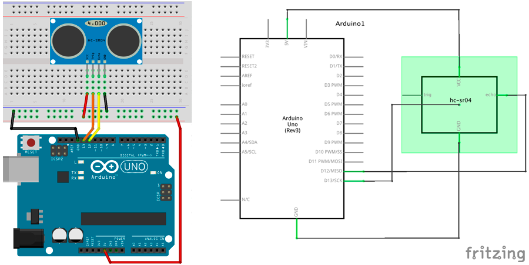

# Medidor de distancias


En esta práctica deberás medir distancias cortas inferiores a 4 metros mediante el sensor de ultrasonidos.

1.	[Materiales](#materiales)
2.	[Diagrama de flujo](#diagrama-de-flujo)
3.	[Esquema eléctrico](#esquema-eléctrico)
4.	[Programación en mBlock](#programación-en-mblock)
5.	[Programación en S4A](#programación-en-s4a)
6.	[Programación en Arduino](#programación-en-arduino)
7.  [Video resumen](#video-resumen)


***


### Materiales

Para llevar a cabo la práctica, vamos a necesitar los siguientes materiales:
- 1 Placa de Arduino UNO
- 1 Protoboard
- 4 latiguillos
- 1 Sensor de ultrasonidos


<br />
<hr>
<br />


### Diagrama de flujo

Antes de ponernos a desarrollar la práctica, conviene realizar un diagrama de flujo para entender la lógica de la programación.


[Descarga el diagrama de flujo para imprimir](Diagrama-de-flujo.html)


<br />
<hr>
<br />


### Esquema eléctrico

Tenemos que tener en cuenta que el sensor de ultrasonidos tiene un rango de medición inferior a 4 metros y valor obtenido es el tiempo transcurrido desde la emisión del pulso hasta la recepción del cambio de pulso, es decir, cuenta el tiempo de ida + vuelta.

| Sensor de proximidad HC-SR04  |           |
| ----------------------------- | --------- |
| Polarizado                    | Si        |
| Señal de salida               | Digital   |
| Tensión                       | 5V        |
| Rango de medición             | 2cm a 4m  |

Para calcular la distancia tenemos que ayudarnos de la velocidad del sonido para obtener los cálculos. Hay que tener en cuenta que el resultado es el tiempo en ida + vuelta.

```
Velocidad del sonido: 343 m/s

```

El siguiente paso será conectar los diferentes componentes sobre la placa de prototipado siguiendo el esquema eléctrico.



[Descarga el esquema eléctrico para Fritzing](Esquema-eléctrico.fzz)


<br />
<hr>
<br />


### Programación en mBlock

Fijándonos en el diagrama de flujo programamos la práctica mediante lenguaje de programación por bloques mBlock. 

Podrás observar el gran parecido que se tiene con el diagrama de flujo.


[Descarga el código para mBlock](mBlock.sb2)


<br />
<hr>
<br />


### Programación en S4A

En el caso de S4A tenemos que utilizar un firmware propio (S4Afirmware14_distancia.ino). En este firmware se han asignado los pines 10 y A5 al sensor de ultrasonidos, de tal forma que el pin 10 y el pin A5 se corresponderá con la distancia al objeto más cercano detectable. 


[Descarga el código para S4A](S4A.sb)


<br />
<hr>
<br />


### Programación en Arduino

Al igual que en el apartado anterior y fijándonos en el diagrama de flujo, programamos en Arduino la práctica propuesta.

```
/**
 * Medidor de distancia
 * 
 * En esta práctica deberás medir distancias cortas inferiores a 4 metros
 * mediante el sensor de ultrasonidos.
 * 
 * @author Miguel Ángel Abellán
 * @company El Cable Amarillo
 * @license Creative Commons. Reconocimiento CompartirIgual 4.0 (Se 
 * permite el uso comercial de la obra y de las posibles obras derivadas, 
 * la distribución de las cuales se debe hacer con una licencia igual a 
 * la que regula la obra original.)
 */

// Se definen las variables de tipo entero
int trigPin = 13;
int echoPin = 12;

//Este código se ejecuta la primera vez
void setup() {
  Serial.begin (9600);
  pinMode(trigPin, OUTPUT);
  pinMode(echoPin, INPUT);

  //Inicialización  de los pines
  digitalWrite(trigPin, LOW);
}

//Este código se ejecuta en bucle repetidamente
void loop() {
  
  //Enviamos un pulso durante 10µs
  digitalWrite(trigPin, HIGH);
  delayMicroseconds(10);
  digitalWrite(trigPin, LOW);

  //Obtenemos la duración del pulso (ida+vuelta) en µs
  long tiempo;
  tiempo = pulseIn(echoPin, HIGH);

  //Calculamos la distancia. Velocidad Sonido = 343 m/s
  float distancia = 34300*tiempo*0.000001;
  distancia = distancia / 2; //Solo IDA
  Serial.print("Distancia: ");
  Serial.println(distancia);
}
```

[Descarga el código para Arduino](Arduino/Arduino.ino)


<br />
<hr>
<br />


### Video resumen

[](https://youtu.be/d7bhh9niuvI)


***


#### Licencia

 Esta obra se distribuye bajo licencia [Reconocimiento-CompartirIgual 4.0 Internacional (CC BY-SA 4.0)](https://creativecommons.org/licenses/by-sa/4.0/deed.es_ES).
