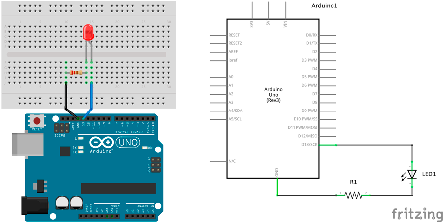

# Luz intermitente


En esta primera práctica vamos a realizar un sencillo proyecto consistente en un LED que parpadea continuamente con una frecuencia de 1 segundo.

1.	[Materiales](#materiales)
2.	[Diagrama de flujo](#diagrama-de-flujo)
3.	[Esquema eléctrico](#esquema-eléctrico)
4.	[Programación en S4A](#programación-en-s4a)
5.	[Programación en Arduino](#programación-en-arduino)
6.  [Video resumen](#video-resumen)


***


### Materiales

Para llevar a cabo la práctica, vamos a necesitar los siguientes materiales:
- 1 Placa de Arduino UNO
- 1 Protoboard
- 2 latiguillos
- 1 Diodo Led
- 1 Resistencia


<br />
=============
<br />


### Diagrama de flujo

Antes de ponernos a desarrollar la práctica, conviene realizar un diagrama de flujo para entender la lógica de la programación.


[Descarga el diagrama de flujo para imprimir](Diagrama de flujo.html)


<br />
=============
<br />


### Esquema eléctrico

Cuando conectamos un componente electrónico a una placa de Arduino, se ejerce sobre él una diferencia de potencial de 5V en ámbos extremos, es decir, si conectamos el Led a una placa de Arduino, estará recibiendo una tensión de 5V, que es la tensión operativa que ejerce Arduino en sus pines.

| Diodos Led                       |        |
| -------------------------------- | ------ |
| Polarizado                       | Sí     |
| Diámetro                         | 5mm    |
| Itensidad de Corriente           | 20mA   |
| Tensión Led (verde, ámbar, rojo) | 2,1V   |
| Tensión Led blanco               | 3,3V   |

Como se puede observar en la tabla anterior, los Led que estamos utilizando para la práctica admiten una tensión máxima de 2,1V para los Led verde, ámbar y rojo y 3,3V para el Led blanco. 

Para evitar que se puedan dañar tendremos que colocarle una resistencia al circuito. Para ello, vamos a calcular el valor de la resistencia siguiendo la *Ley de Ohm* y teniendo en cuenta los datos de la tabla anterior.

La tensión en el Led tiene que ser 2,1V. Si el pin de Arduino da 5V, el tensión que debe circular por la resistencia es 5V – 2,1V = 2,9V. 

Por otro lado, la intensidad que circula por el Led es de 20mA. A diferencia de la tensión, la intensidad se mantiene constante durante el circuito.


```

V = 2,9V
I = 20mA

V = I x R ; R = V / I

R = 2,9V / 0,02A = 145Ω 

```

Redondeamos el resultado obtenido a un valor de resistencia (siempre por encima de su resistencia ideal), obteniendo una resistencia de 220Ω, que mirando en la tabla de resistencias corresponde a la resistencia de color *rojo-rojo-marrón*.

El siguiente paso será conectar los diferentes componentes sobre la placa de prototipado siguiendo el esquema eléctrico.



[Descarga el esquema eléctrico para Fritzing](Esquema eléctrico.fzz)


<br />
=============
<br />


### Programación en S4A

Fijándonos en el diagrama de flujo programamos la práctica mediante lenguaje de programación por bloques S4A. 

Podrás observar el gran parecido que se tiene con el diagrama de flujo.


[Descarga el código para S4A](S4A.sb)


<br />
=============
<br />


### Programación en Arduino

Al igual que en el apartado anterior y fijándonos en el diagrama de flujo, programamos en Arduino la práctica propuesta.

```
/**
 * Luz intermitente
 * 
 * En esta primera práctica vamos a realizar un sencillo proyecto 
 * consistente en un LED que parpadea continuamente con una frecuencia 
 * de 1 segundo.
 * 
 * @author Miguel Ángel Abellán
 * @company El Cable Amarillo
 * @license Creative Commons. Reconocimiento CompartirIgual 4.0 (Se 
 * permite el uso comercial de la obra y de las posibles obras derivadas, 
 * la distribución de las cuales se debe hacer con una licencia igual a 
 * la que regula la obra original.)
 */

// Definimos las variables de tipo entero
int ledPin = 13;
int delayTime = 1000;

//Este código se ejecuta la primera vez
void setup() {
  // Configuramos el pin en modo salida
  pinMode(ledPin, OUTPUT);
}

//Este código se ejecuta en bucle repetidamente
void loop() {
  // Escribimos en el pin el valor ALTO y esperamos
  digitalWrite(ledPin, HIGH);
  delay(delayTime);
  // Escribimos en el pin el valor BAJO y esperamos 
  digitalWrite(ledPin, LOW);
  delay(delayTime);
}
```

[Descarga el código para Arduino](Arduino/Arduino.ino)


<br />
=============
<br />


### Video resumen

[](https://youtu.be/yh4atShl390)


***


#### Licencia

 Esta obra se distribuye bajo licencia [Reconocimiento-CompartirIgual 4.0 Internacional (CC BY-SA 4.0)](https://creativecommons.org/licenses/by-sa/4.0/deed.es_ES).
