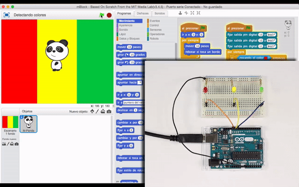
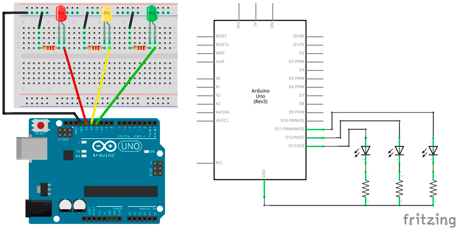
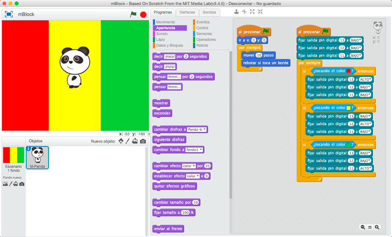

# Detectando colores

En esta práctica tenemos que detectar los colores por los cuales se mueve nuestro personaje para activar los diferentes diodos Led de la placa de prototipado.

1.	[Materiales](#materiales)
2.	[Esquema eléctrico](#esquema-eléctrico)
3.	[Programación en mBlock](#programación-en-mblock)

***

### Materiales

Para llevar a cabo la práctica, vamos a necesitar los siguientes materiales:
- 1 Placa de Arduino UNO
- 1 Protoboard
- 4 latiguillos
- 3 Diodo Led
- 3 Resistencia

 

 

### Esquema eléctrico

El siguiente paso será conectar los diferentes componentes sobre la placa de prototipado siguiendo el esquema eléctrico.

 

 

### Programación en mBlock

La programación de este videojuego se puede observar en la siguiente imagen.

[Descarga el código para mBlock](mBlock.sb2)

***

#### Licencia

 Esta obra se distribuye bajo licencia [Reconocimiento-CompartirIgual 4.0 Internacional (CC BY-SA 4.0)](https://creativecommons.org/licenses/by-sa/4.0/deed.es_ES).
