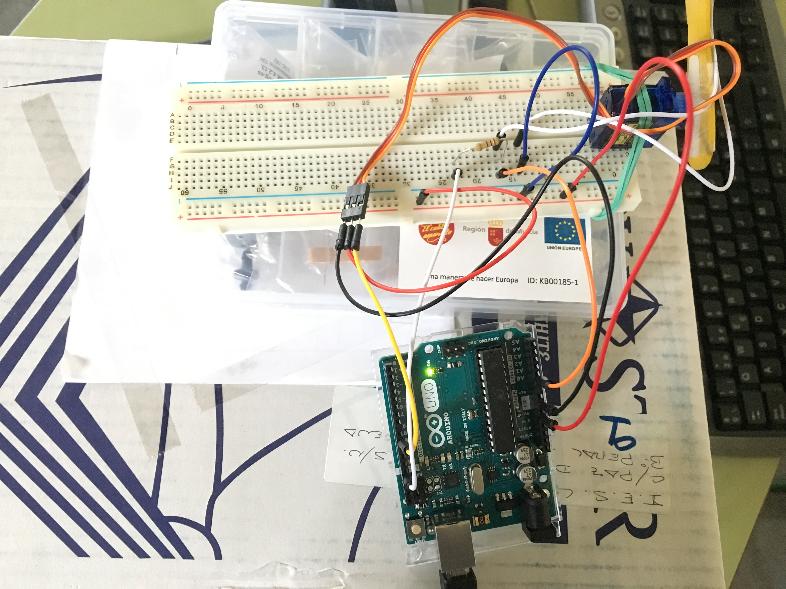

# Contador Láser

El proyecto consiste en crear un juego contador láser. Se dispone de un sensor LDR que se está moviendo por un servo motor y cuando el sensor es alcanzado por un puntero láser, el contador suma una unidad. El movimiento del sensor es errático.

### Autor de la práctica:
    1. José Tárraga Sánchez

### Contenido

- [Resumen](Resumen.pdf)
- [Programación](Programación.SB2)
- [Fritzing](Fritzing.fzz)

 

***

#### Licencia

 Esta obra se distribuye bajo licencia [Reconocimiento-CompartirIgual 4.0 Internacional (CC BY-SA 4.0)](https://creativecommons.org/licenses/by-sa/4.0/deed.es_ES).
