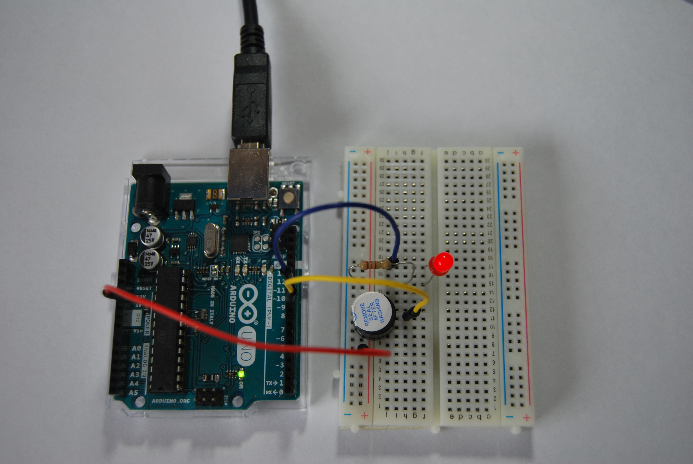

# Código Morse

En esta práctica vamos a emitir una señal de socorro (SOS) en código Morse con un zumbador y al mismo tiempo se ha añadido una señal luminosa con un diodo LED rojo.SOS es la señal de socorro más utilizada internacionalmente. Se comenzó a utilizar a principios del siglo XX. Se eligió esta representación debido a que podía ser radiada fácilmente usando el código Morse (el código Morse utiliza pulsos cortos y pulsos largos), con una sucesión de tres pulsos cortos, tres largos y otros tres cortos  ( . . . _ _ _ . . . ). De igual manera, debido a la simpleza de la misma es menos probable que se pierda o malinterprete por interferencias. 

### Autor de la práctica:
    1. María Soledad Alcaraz Albaladejo

### Materiales

1 placa de Arduino UNO
1 protoboard
3 latiguillos
1 diodo LED rojo
1 zumbador
1 resistencia

### Descripción

El ejercicio consiste en programar la emisión de la señal de socorro, emitiendo 3 pulsos cortos (durante unos segundos, en este caso he optado por 0,3 s) luego 3 largos ( a los que he asignado 1 s) y nuevamente 3 cortos. A continuación hacemos una pausa  (0,5 segundos es suficiente) y volvemos a empezar.

El siguiente paso será conectar los diferentes componentes sobre la placa de prototipado siguiendo el esquema eléctrico. Conectamos el zumbador a la salida digital 9 y el LED a la salida digital 11.

La tensión en el Led tiene que ser 2,1V. Si el pin de Arduino da 5V, la tensión que debe circular por la resistencia es 5V – 2,1V = 2,9V. Por otro lado, la intensidad que circula por el Led es de 20mA (0,02A). Aplicando la Ley de Ohm se obtienen 145Ω y redondeamos el resultado obtenido a un valor de resistencia por encima de su resistencia ideal, obteniendo una resistencia de 220Ω, que mirando en la tabla de resistencias corresponde a la resistencia de color rojo-rojo-marrón. No va a ser necesario añadir ninguna resistencia al zumbador.

### Contenido

- [Resumen](Resumen.pdf)
- [Programación](Programación.SB2)
- [Fritzing](Fritzing.fzz)
- [Video](Video.mp4)

 

***

#### Licencia

 Esta obra se distribuye bajo licencia [Reconocimiento-CompartirIgual 4.0 Internacional (CC BY-SA 4.0)](https://creativecommons.org/licenses/by-sa/4.0/deed.es_ES).
