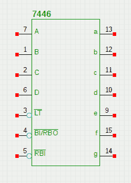
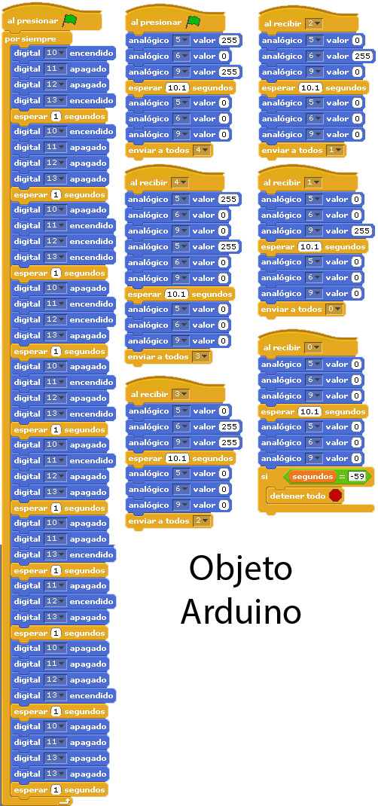
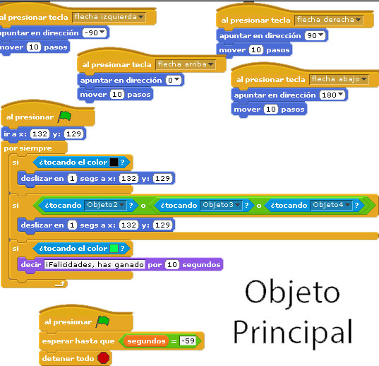
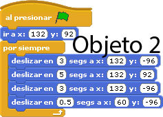
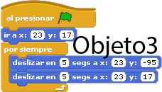
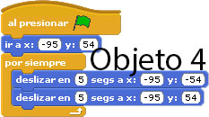
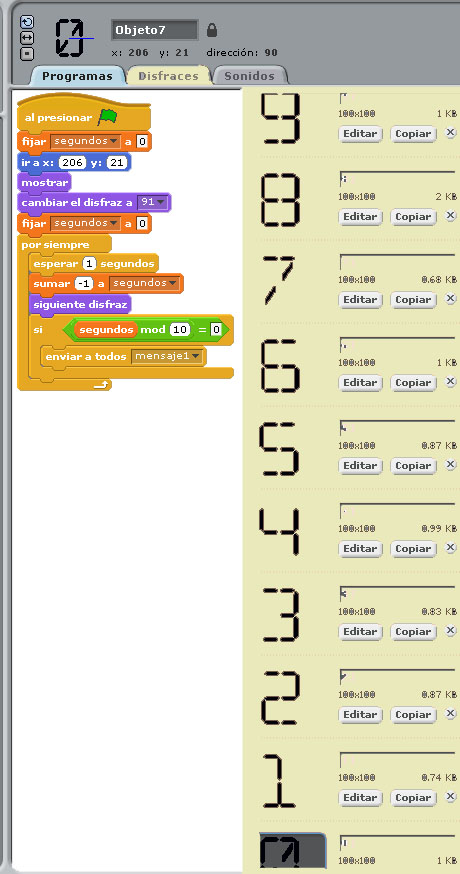
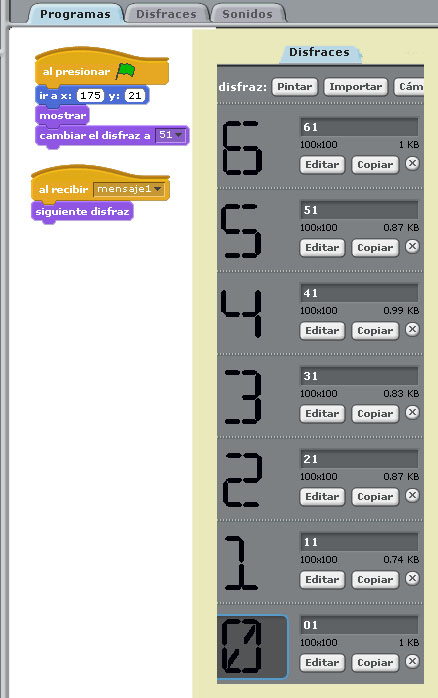

# Laberinto con Display

En  la presente práctica vamos a programar el encendido de un Led, de forma que se intercalen los colores rojo y azul, mientras suena la sirena.

### Autor de la práctica:
    1. José Agustín Vera Pintado

### Contenido

- [Video](Video.mp4)

 

***

#### Licencia

 Esta obra se distribuye bajo licencia [Reconocimiento-CompartirIgual 4.0 Internacional (CC BY-SA 4.0)](https://creativecommons.org/licenses/by-sa/4.0/deed.es_ES).
