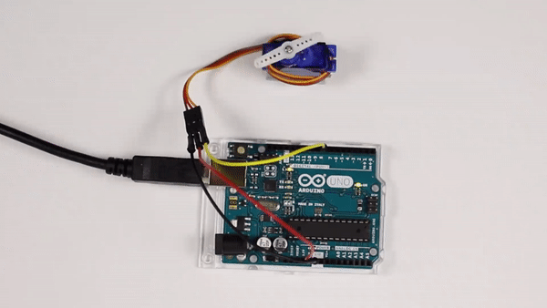
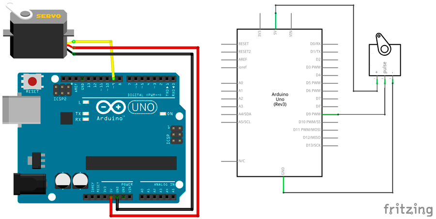
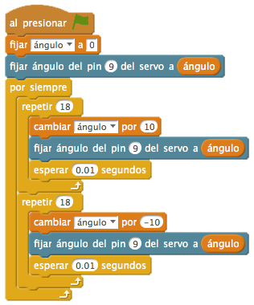
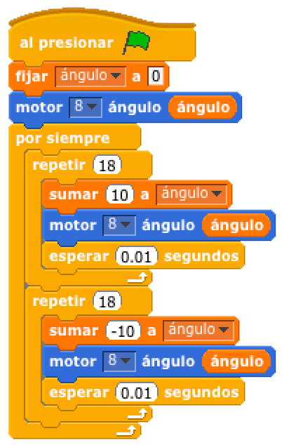

# Movimiento de un servomotor



En esta práctica el servomotor se mueve desde su posición origen a su posición final en ángulos de 10° repetidamente.

1.	[Materiales](#materiales)
2.	[Diagrama de flujo](#diagrama-de-flujo)
3.	[Esquema eléctrico](#esquema-eléctrico)
4.	[Programación en mBlock](#programación-en-mblock)
5.	[Programación en S4A](#programación-en-s4a)
6.	[Programación en Arduino](#programación-en-arduino)
7.  [Video resumen](#video-resumen)


***


### Materiales

Para llevar a cabo la práctica, vamos a necesitar los siguientes materiales:
- 1 Placa de Arduino UNO
- 3 latiguillos
- 1 Servomotor


<br />
<hr>
<br />


### Diagrama de flujo

Antes de ponernos a desarrollar la práctica, conviene realizar un diagrama de flujo para entender la lógica de la programación.


[Descarga el diagrama de flujo para imprimir](Diagrama-de-flujo.html)


<br />
<hr>
<br />


### Esquema eléctrico

Estos servomotores funcionan con un periodo de 20ms, es decir, podremos cambiar de posición cada 20ms como mínimo.

| Servo motores      |                  |
| ------------------ | ---------------- |
| Polarizado         | Sí               |
| Tensión operativa  | 4,8V             |
| Rotación           | 0° a 180°        |
| Torque estático    | 4,5V > 1,5Kg/cm  |

Los servomotores que encontramos en el kit suelen tener los cables con los colores marrón, rojo y naranja, los cuales se corresponden con el GND, 5V y Pin de salida analógica respectivamente.

El siguiente paso será conectar el servomotor a los pines correspondientes de nuestra placa de Arduino.



[Descarga el esquema eléctrico para Fritzing](Esquema-eléctrico.fzz)


<br />
<hr>
<br />


### Programación en mBlock

Fijándonos en el diagrama de flujo programamos la práctica mediante lenguaje de programación por bloques mBlock. 

Podrás observar el gran parecido que se tiene con el diagrama de flujo.



[Descarga el código para mBlock](mBlock.sb2)


<br />
<hr>
<br />


### Programación en S4A

Fijándonos en el diagrama de flujo programamos la práctica mediante lenguaje de programación por bloques S4A. 

Hay que tener en cuenta que en S4A se toman las salidas del servomotor en el pin 8, 4 ó 7.

Podrás observar el gran parecido que se tiene con el diagrama de flujo.



[Descarga el código para S4A](S4A.sb)


<br />
<hr>
<br />


### Programación en Arduino

Al igual que en el apartado anterior y fijándonos en el diagrama de flujo, programamos en Arduino la práctica propuesta.

```
/**
 * Movimiento de un servomotor
 * 
 * En esta práctica el servomotor se mueve desde su posición origen a 
 * su posición final en ángulos de 10° repetidamente.
 * 
 * @author Miguel Ángel Abellán
 * @company El Cable Amarillo
 * @license Creative Commons. Reconocimiento CompartirIgual 4.0 (Se 
 * permite el uso comercial de la obra y de las posibles obras derivadas, 
 * la distribución de las cuales se debe hacer con una licencia igual a 
 * la que regula la obra original.)
 */

// Importamos la librería del servomotor
#include <Servo.h>

// Definimos la variable de tipo servo
Servo servomotor;

//Este código se ejecuta la primera vez
void setup() {
  // Configuramos los pines en modo salida
  servomotor.attach(9);
}

//Este código se ejecuta en bucle repetidamente
void loop() {
  for(int i=0; i<=180; i+=10){
    servomotor.write(i);
    delay(100);
  }
  for(int i=180; i>=0; i-=10){
    servomotor.write(i);
    delay(100);
  }
}
```

[Descarga el código para Arduino](Arduino/Arduino.ino)


<br />
<hr>
<br />


### Video resumen

[](https://youtu.be/Ip1fKHFy1cY)


***


#### Licencia

 Esta obra se distribuye bajo licencia [Reconocimiento-CompartirIgual 4.0 Internacional (CC BY-SA 4.0)](https://creativecommons.org/licenses/by-sa/4.0/deed.es_ES).
