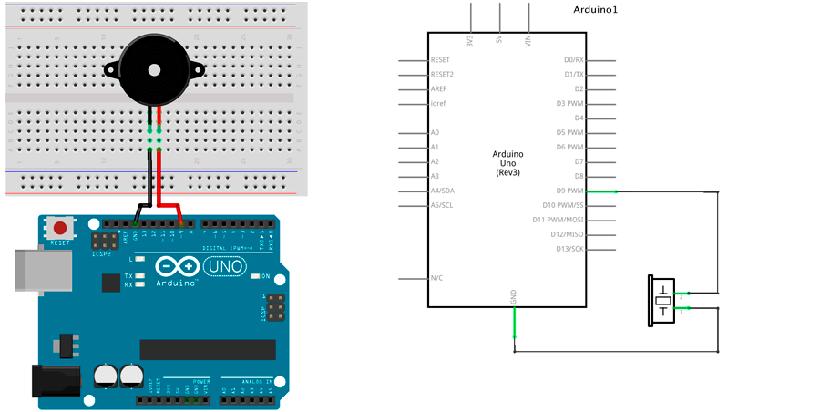
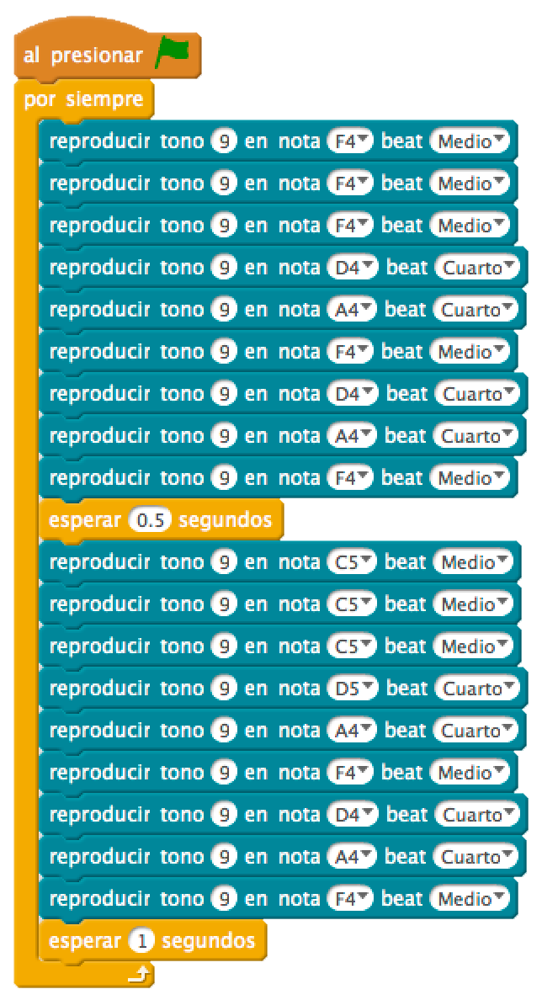

# La Guerra de las Galaxias


A través de un zumbador reproducimos la banda sonora de La Guerra de las Galaxias mediante frecuencias.
 
1.	[Materiales](#materiales)
2.	[Diagrama de flujo](#diagrama-de-flujo)
3.	[Esquema eléctrico](#esquema-eléctrico)
4.	[Programación en mBlock](#programación-en-mBlock)
5.	[Programación en S4A](#programación-en-s4a)
6.	[Programación en Arduino](#programación-en-arduino)
7.  [Video resumen](#video-resumen)


***


### Materiales

Para llevar a cabo la práctica, vamos a necesitar los siguientes materiales:
- 1 Placa de Arduino UNO
- 1 Protoboard
- 2 latiguillos
- 1 Zumbador


<br />
<hr>
<br />


### Diagrama de flujo

En este caso vamos a representar el diagrama de flujo siguiendo la partitura de la canción a reproducir.


<br />
<hr>
<br />


### Esquema eléctrico

Como se puede observar en la siguiente tabla no vamos a necesitar ningún tipo de resistencia para conectar ennuestro circuito.

| Zumbador piezo-eléctrico         |       |
| -------------------------------- | ----- |
| Polarizado                       | Sí    |
| Tensión de trabajo               | 3-12V |

El siguiente paso será conectar los diferentes componentes sobre la placa de prototipado siguiendo el esquema eléctrico.



[Descarga el esquema eléctrico para Fritzing](Esquema-eléctrico.fzz)


<br />
<hr>
<br />


### Programación en mBlock

Fijándonos en el diagrama de flujo programamos la práctica mediante lenguaje de programación por bloques mBlock. 

Podrás observar el gran parecido que se tiene con el diagrama de flujo.



[Descarga el código para mBlock](mBlock.sb2)


<br />
<hr>
<br />


### Programación en S4A

Esta práctica no puede realizarse en S4A por no disponer de la función TONE de Arduino.


<br />
<hr>
<br />


### Programación en Arduino

Al igual que en el apartado anterior y fijándonos en el diagrama de flujo, programamos en Arduino la práctica propuesta.

```
/**
 * La Guerra de las Galaxias
 * 
 * A través de un zumbador reproducimos la banda sonora de La Guerra
 * de las Galaxias mediante frecuencias.
 * 
 * @author Miguel Ángel Abellán
 * @company El Cable Amarillo
 * @license Creative Commons. Reconocimiento CompartirIgual 4.0 (Se 
 * permite el uso comercial de la obra y de las posibles obras derivadas, 
 * la distribución de las cuales se debe hacer con una licencia igual a 
 * la que regula la obra original.)
 */

// Definimos la variable del zumbador de tipo entero
int zumbadorPin = 9;

// En cada array reproducimos las 5 frecuencias de cada nota
int c[5]={131,262,523,1046,2093}; // Do
int d[5]={147,294,587,1175,2349}; // Re
int e[5]={165,330,659,1319,2637}; // Mi
int f[5]={175,349,698,1397,2794}; // Fa
int g[5]={196,392,784,1568,3136}; // Sol
int a[5]={220,440,880,1760,3520}; // La
int b[5]={247,494,988,1976,3951}; // Si


// Funcion para reproducir una nota durante un determinado tiempo
void nota(int frecuencia, int duracion)
{
  tone(zumbadorPin, frecuencia);
  delay(duracion);
  noTone(zumbadorPin);
  delay(50);

}

//Este código se ejecuta la primera vez
void setup() {

}

//Este código se ejecuta en bucle repetidamente
void loop() {
  nota(f[2],500);
  nota(f[2],500);
  nota(f[2],500);
  nota(d[2],250);
  nota(a[2],250);
  nota(f[2],500);
  nota(d[2],250);
  nota(a[2],250);
  nota(f[2],500);
  delay(500);
  nota(c[3],500);
  nota(c[3],500);
  nota(c[3],500);
  nota(d[3],250);
  nota(a[2],250);
  nota(f[2],500);
  nota(d[2],250);
  nota(a[2],250);
  nota(f[2],500);
  delay(1000);
}
```

[Descarga el código para Arduino](Arduino/Arduino.ino)


<br />
<hr>
<br />


### Video resumen

[](https://youtu.be/vYoskyTfNQM)


***


#### Licencia

 Esta obra se distribuye bajo licencia [Reconocimiento-CompartirIgual 4.0 Internacional (CC BY-SA 4.0)](https://creativecommons.org/licenses/by-sa/4.0/deed.es_ES).
