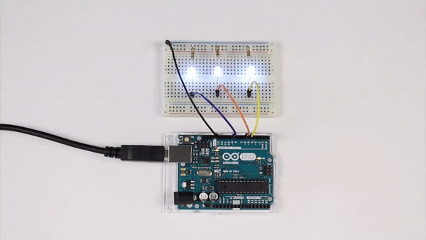
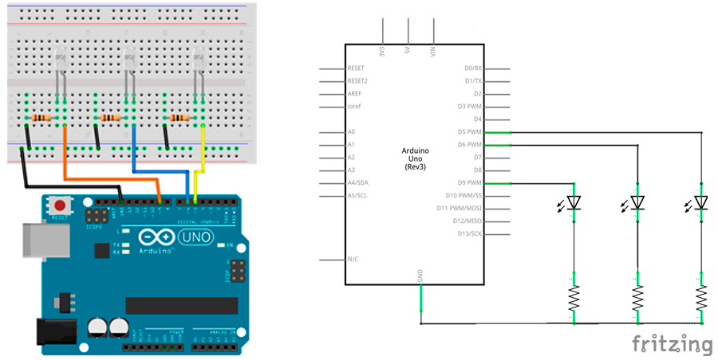
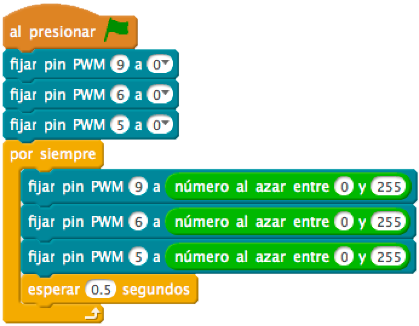
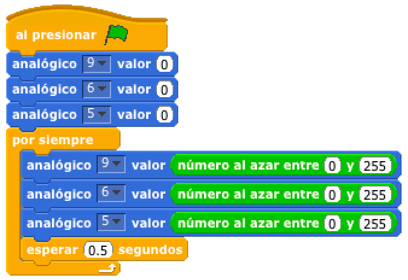

# Luces de navidad



En esta práctica vamos a tratar de encender de forma aleatoria 3 Diodos Led de color blanco utilizando las salidas analógicas y con valores aleatorios.

1.	[Materiales](#materiales)
2.	[Diagrama de flujo](#diagrama-de-flujo)
3.	[Esquema eléctrico](#esquema-eléctrico)
4.	[Programación en mBlock](#programación-en-mblock)
5.	[Programación en S4A](#programación-en-s4a)
6.	[Programación en Arduino](#programación-en-arduino)
7.  [Video resumen](#video-resumen)


***


### Materiales

Para llevar a cabo la práctica, vamos a necesitar los siguientes materiales:
- 1 Placa de Arduino UNO
- 1 Protoboard
- 4 latiguillos
- 3 Diodos Led (blancos)
- 3 Resistencia


<br />
<hr>
<br />


### Diagrama de flujo

Antes de ponernos a desarrollar la práctica, conviene realizar un diagrama de flujo para entender la lógica de la programación.


[Descarga el diagrama de flujo para imprimir](Diagrama-de-flujo.html)


<br />
<hr>
<br />


### Esquema eléctrico

Al conectar un diodo led a una placa de Arduino, se ejerce sobre él una diferencia de potencial de 5V, es decir, estará recibiendo un voltaje o tensión de 5V (que es la tensión operativa que ejerce Arduino en sus pines).

| Diodos Led                       |        |
| -------------------------------- | ------ |
| Polarizado                       | Sí     |
| Itensidad de Corriente           | 20mA   |
| Tensión Led (verde, ámbar, rojo) | 2,1V   |
| Tensión Led blanco               | 3,3V   |

Como se puede observar en la tabla anterior, los diodos Led blancos que vamos a utilizar para la práctica admiten una tensión de 3,3V. 

Para evitar que se puedan dañar tendremos que colocarle una resistencia al circuito. Para ello, vamos a calcular el valor de la resistencia siguiendo la *Ley de Ohm* y teniendo en cuenta los datos de la tabla anterior.

Si los pines de Arduino ofrecen una tensión de 5V y la tensión máxima del diodo Led admite 3,3V, la diferencia de potencial que debemos tener en el diodo Led es de 5V – 3,3V = 1,7V. 

Colocando una resistencia al circuito estaremos disminuyendo la tensión. A diferencia de la tensión, la intensidad se mantiene constante durante el circuito con un valor de 20mA (que es la intensidad que ofrecen los pines de Arduino).


```

V = 1,7V
I = 20mA

V = I x R ; R = V / I

R = 1,7V / 0,02A = 85Ω 

```

Redondeamos el resultado obtenido a un valor de resistencia conocido (siempre por encima de su resistencia ideal), obtenemos un valor de 100Ω (marrón-negro-marrón).

El siguiente paso será conectar los diferentes componentes sobre la placa de prototipado siguiendo el esquema eléctrico.



[Descarga el esquema eléctrico para Fritzing](Esquema-eléctrico.fzz)


<br />
<hr>
<br />


### Programación en mBlock

Fijándonos en el diagrama de flujo programamos la práctica mediante lenguaje de programación por bloques mBlock. 

Podrás observar el gran parecido que se tiene con el diagrama de flujo.



[Descarga el código para mBlock](mBlock.sb2)


<br />
<hr>
<br />


### Programación en S4A

Fijándonos en el diagrama de flujo programamos la práctica mediante lenguaje de programación por bloques S4A. 

Podrás observar el gran parecido que se tiene con el diagrama de flujo.



[Descarga el código para S4A](S4A.sb)


<br />
<hr>
<br />


### Programación en Arduino

Al igual que en el apartado anterior y fijándonos en el diagrama de flujo, programamos en Arduino la práctica propuesta.

```
/**
 * Luces de navidad
 * 
 * En esta práctica vamos a tratar de encender de forma aleatoria
 * 3 Diodos Led de color blanco utilizando las salidas analógicas
 * y con valores aleatorios.
 * 
 * @author Miguel Ángel Abellán
 * @company El Cable Amarillo
 * @license Creative Commons. Reconocimiento CompartirIgual 4.0 (Se 
 * permite el uso comercial de la obra y de las posibles obras derivadas, 
 * la distribución de las cuales se debe hacer con una licencia igual a 
 * la que regula la obra original.)
 */

// Definimos las variables de tipo entero
int ledPin1 = 9;
int ledPin2 = 6;
int ledPin3 = 5;
int delayTime = 500;

//Este código se ejecuta la primera vez
void setup() {
  // Configuramos los pines en modo salida
  pinMode(ledPin1, OUTPUT);
  pinMode(ledPin2, OUTPUT);
  pinMode(ledPin3, OUTPUT);
  // Inicializamos los pines a un valor BAJO
  analogWrite(ledPin1, 0);
  analogWrite(ledPin2, 0);
  analogWrite(ledPin3, 0);
}

//Este código se ejecuta en bucle repetidamente
void loop() {
  // Escribimos el valor aleatorio en cada pin
  analogWrite(ledPin1, random(0, 255));
  analogWrite(ledPin2, random(0, 255));
  analogWrite(ledPin3, random(0, 255));
  // Esperamos
  delay(delayTime);

}
```

[Descarga el código para Arduino](Arduino/Arduino.ino)


<br />
<hr>
<br />


### Video resumen

[](https://youtu.be/kcP-vLavYOo)


***


#### Licencia

 Esta obra se distribuye bajo licencia [Reconocimiento-CompartirIgual 4.0 Internacional (CC BY-SA 4.0)](https://creativecommons.org/licenses/by-sa/4.0/deed.es_ES).
