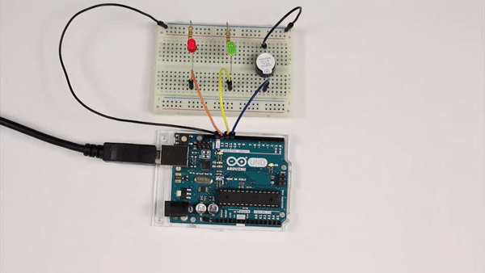
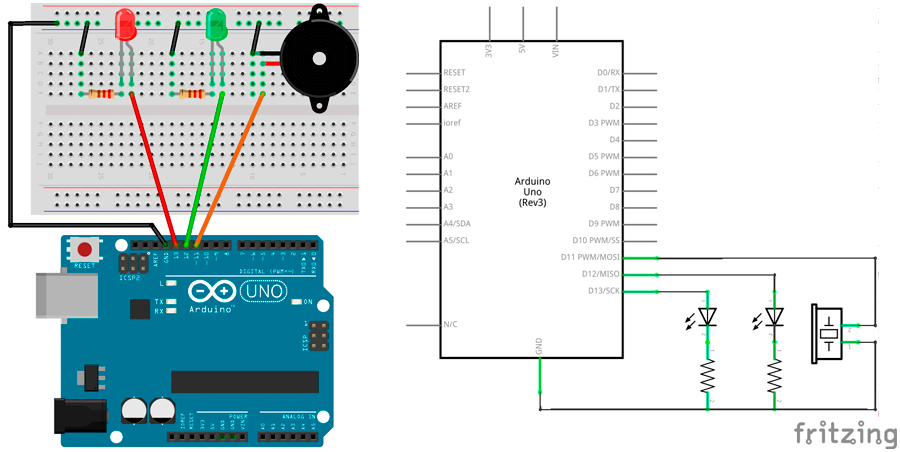
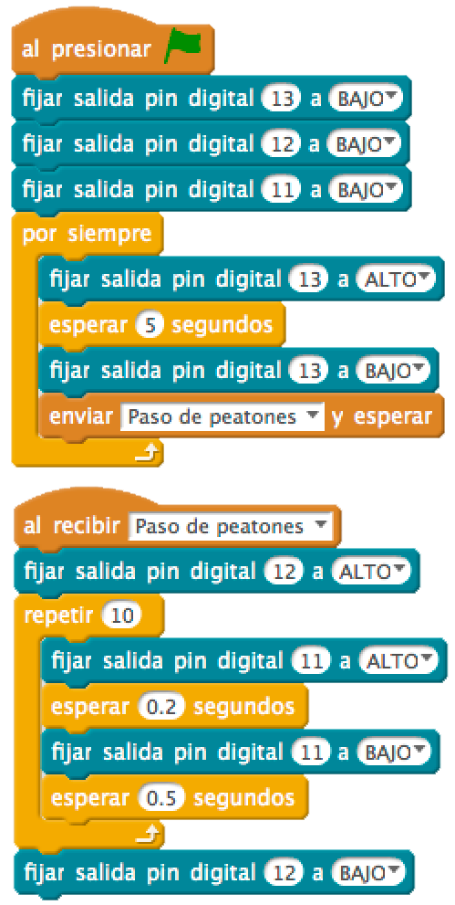
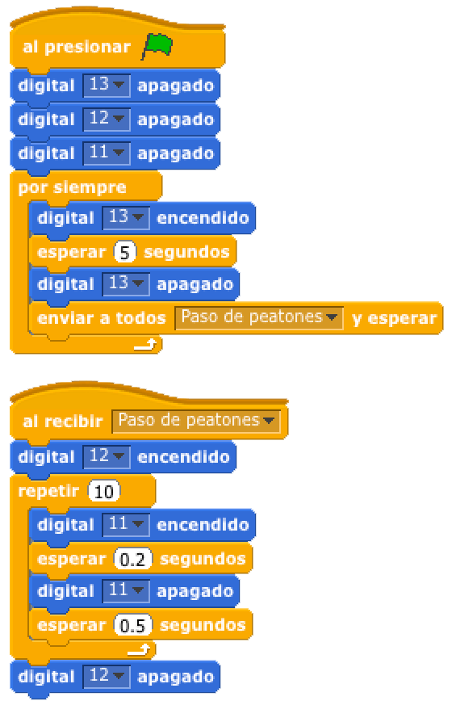

# Semáforo para invidentes



En esta práctica vamos a simular el semáforo para peatones invidentes a través de 1 zumbador que avisa al peatón.

1.	[Materiales](#materiales)
2.	[Diagrama de flujo](#diagrama-de-flujo)
3.	[Esquema eléctrico](#esquema-eléctrico)
4.	[Programación en mBlock](#programación-en-mBlock)
5.	[Programación en S4A](#programación-en-s4a)
6.	[Programación en Arduino](#programación-en-arduino)
7.  [Video resumen](#video-resumen)


***


### Materiales

Para llevar a cabo la práctica, vamos a necesitar los siguientes materiales:
- 1 Placa de Arduino UNO
- 1 Protoboard
- 5 latiguillos
- 2 Diodo Led
- 2 Resistencia
- 1 Zumbador


<br />
<hr>
<br />


### Diagrama de flujo

Antes de ponernos a desarrollar la práctica, conviene realizar un diagrama de flujo para entender la lógica de la programación.


[Descarga el diagrama de flujo para imprimir](Diagrama-de-flujo.html)


<br />
<hr>
<br />


### Esquema eléctrico

Como se puede observar en la siguiente tabla, los Led que estamos utilizando para la práctica admiten una tensión máxima de 2,1V. Por otro lado, no va a ser necesario añadir ninguna resistencia al zumbador.

| Diodos Led                       |        |
| -------------------------------- | ------ |
| Polarizado                       | Sí     |
| Diámetro                         | 5mm    |
| Itensidad de Corriente           | 20mA   |
| Tensión Led (verde, ámbar, rojo) | 2,1V   |
| Tensión Led blanco               | 3,3V   |

| Zumbador piezo-eléctrico         |       |
| -------------------------------- | ----- |
| Polarizado                       | Sí    |
| Tensión de trabajo               | 3-12V |

Para evitar que se puedan dañar los leds tendremos que colocarle una resistencia al circuito. Para ello, vamos a calcular el valor de la resistencia siguiendo la *Ley de Ohm* y teniendo en cuenta los datos de la tabla anterior.

La tensión en el Led tiene que ser 2,1V. Si el pin de Arduino da 5V, el tensión que debe circular por la resistencia es 5V – 2,1V = 2,9V. 

Por otro lado, la intensidad que circula por el Led es de 20mA. A diferencia de la tensión, la intensidad se mantiene constante durante el circuito.


```

V = 2,9V
I = 20mA

V = I x R ; R = V / I

R = 2,9V / 0,02A = 145Ω 

```

Redondeamos el resultado obtenido a un valor de resistencia (siempre por encima de su resistencia ideal), obteniendo una resistencia de 220Ω, que mirando en la tabla de resistencias corresponde a la resistencia de color *rojo-rojo-marrón*.

El siguiente paso será conectar los diferentes componentes sobre la placa de prototipado siguiendo el esquema eléctrico.



[Descarga el esquema eléctrico para Fritzing](Esquema-eléctrico.fzz)


<br />
<hr>
<br />


### Programación en mBlock

Fijándonos en el diagrama de flujo programamos la práctica mediante lenguaje de programación por bloques mBlock. 

Podrás observar el gran parecido que se tiene con el diagrama de flujo.



[Descarga el código para mBlock](mBlock.sb2)


<br />
<hr>
<br />


### Programación en S4A

Fijándonos en el diagrama de flujo programamos la práctica mediante lenguaje de programación por bloques S4A. 

Podrás observar el gran parecido que se tiene con el diagrama de flujo.



[Descarga el código para S4A](S4A.sb)


<br />
<hr>
<br />


### Programación en Arduino

Al igual que en el apartado anterior y fijándonos en el diagrama de flujo, programamos en Arduino la práctica propuesta.

```
/**
 * Semáforo para invidentes
 *
 * En esta práctica vamos a simular el semáforo para peatones invidentes 
 * a través de 1 zumbador que avisa al peatón.
 *
 * @author Miguel Ángel Abellán
 * @company El Cable Amarillo
 * @license Creative Commons. Reconocimiento CompartirIgual 4.0 (Se
 * permite el uso comercial de la obra y de las posibles obras derivadas,
 * la distribución de las cuales se debe hacer con una licencia igual a
 * la que regula la obra original.)
 */

// Definimos las variables de tipo entero
int ledPinRojo = 13;
int ledPinVerde = 12;
int ledPinZumbador = 11;

//Este código se ejecuta la primera vez
void setup() {
  // Configuramos los pines en modo salida
  pinMode(ledPinRojo, OUTPUT);
  pinMode(ledPinVerde, OUTPUT);
  pinMode(ledPinZumbador, OUTPUT);
  // Inicializamos los pines a un valor BAJO
  digitalWrite(ledPinRojo, LOW);
  digitalWrite(ledPinVerde, LOW);
  digitalWrite(ledPinZumbador, LOW);
}

//Este código se ejecuta en bucle repetidamente
void loop() {
  // Mostramos el led de color rojo
  digitalWrite(ledPinRojo, HIGH);
  delay(5000);
  digitalWrite(ledPinRojo, LOW);
  
  // Mientras el semáforo está en verde suena el zumbador
  digitalWrite(ledPinVerde, HIGH);
  for(int i=0; i<10; i++){
    digitalWrite(ledPinZumbador, HIGH);
    delay(200);
    digitalWrite(ledPinZumbador, LOW);
    delay(500);
  }
  digitalWrite(ledPinVerde, LOW);
}
```

[Descarga el código para Arduino](Arduino/Arduino.ino)


<br />
<hr>
<br />


### Video resumen

[](https://youtu.be/wJ3vcopm6rQ)


***


#### Licencia

 Esta obra se distribuye bajo licencia [Reconocimiento-CompartirIgual 4.0 Internacional (CC BY-SA 4.0)](https://creativecommons.org/licenses/by-sa/4.0/deed.es_ES).
